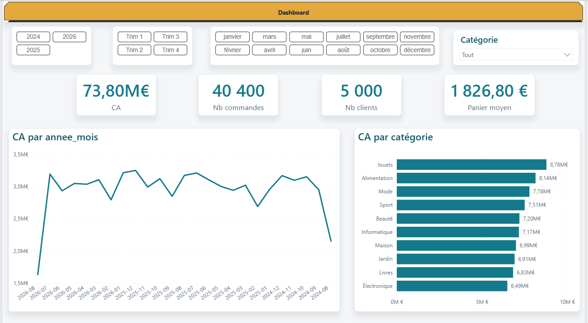

# Projet 13 — Entrepôt central BigQuery (ELT cloud)

> Les 12 premiers projets tournent en local (Docker, DuckDB, SQLite). Celui-ci
> répond à une question différente : **et si le portfolio devait vivre dans le
> cloud ?** Même base source (Projet 07), même modèle en étoile (Projet 09),
> mais l'infra change complètement — BigQuery, IAM, facturation réelle,
> environnement cloud avec ses propres pannes.

## 📸 Aperçu



## 🧩 Ce que fait le projet

```
PostgreSQL (Projet 07, Docker) ──dlt──► BigQuery.raw ──dbt──► staging ──dbt──► marts (étoile) ──► Power BI
```

1. **Extraction** ([`src/load_postgres_to_bq.py`](src/load_postgres_to_bq.py)) —
   `dlt` réplique les 7 tables de la base e-commerce (Projet 07) vers le
   dataset `raw`, rejouable à volonté (`write_disposition="replace"`).
2. **Transformation** ([`models/`](models/)) — dbt-bigquery construit
   `staging` (7 vues de nettoyage) puis `marts` (modèle en étoile : 3
   dimensions + 1 table de faits), **le même modèle que le
   [Projet 09](https://github.com/valentinratigniet-byte/projet-09-dashboard-powerbi)**,
   réécrit en SQL BigQuery.
3. **Qualité** — 12 tests dbt (unicité, non-nullité, intégrité référentielle
   fait → dimensions).
4. **Restitution** — Power BI se connecte directement au dataset `marts`
   (natif étoile, prêt à modéliser). Modèle **documenté in-situ** (description
   sur chaque table, colonne clé et mesure — voir
   [docs/data-dictionary.md](docs/data-dictionary.md)) et 17 mesures DAX
   reprises du [Projet 09](../projet-09-dashboard-powerbi/dax/measures.md).

## 📊 Résultats

| Table | Lignes | Type |
|---|---|---|
| `raw.customer` / `raw.orders` / `raw.order_item` / `raw.payment` / `raw.product` | 5 000 / 40 400 / 121 331 / 34 302 / 2 000 | brut (dlt) |
| `marts.dim_customer` / `dim_product` / `dim_date` | 5 000 / 2 000 / 733 | dimension |
| `marts.fct_sales` | 121 300 | fait |

**dbt test : 12/12 PASS.**

## 🚀 Reproduire

Prérequis : `gcloud` CLI connecté, projet GCP avec facturation activée
(reste dans le free tier — volumes très en dessous des seuils gratuits),
Docker + base du [Projet 07](../projet-07-base-ecommerce) démarrée.

```bash
python -m venv .venv && .venv\Scripts\activate      # Windows
pip install -r requirements.txt

# 1. Infra (une fois) — datasets + compte de service
gcloud services enable bigquery.googleapis.com
bq --location=EU mk --dataset <projet>:raw
bq --location=EU mk --dataset <projet>:staging
bq --location=EU mk --dataset <projet>:marts
gcloud iam service-accounts create dbt-loader
gcloud iam service-accounts keys create ~/.gcp/dbt-loader.json \
  --iam-account=dbt-loader@<projet>.iam.gserviceaccount.com

# 2. Extraction PostgreSQL -> raw
export GOOGLE_APPLICATION_CREDENTIALS=~/.gcp/dbt-loader.json
python src/load_postgres_to_bq.py

# 3. Transformation + tests
dbt run --profiles-dir ~/.dbt
dbt test --profiles-dir ~/.dbt
dbt docs generate --profiles-dir ~/.dbt && dbt docs serve   # lignage navigable
```

`~/.dbt/profiles.yml` attendu (voir [docs/architecture.md](docs/architecture.md)
pour le détail infra) :

```yaml
portfolio_bq:
  target: dev
  outputs:
    dev:
      type: bigquery
      method: service-account
      keyfile: "{{ env_var('GOOGLE_APPLICATION_CREDENTIALS') }}"
      project: <ton-projet-gcp>
      dataset: staging
      location: EU
      threads: 4
```

## 🗂️ Structure

```
projet-13-entrepot-central-bigquery/
├── src/load_postgres_to_bq.py   ← extraction dlt (PostgreSQL -> raw)
├── models/
│   ├── staging/                 ← 7 vues de nettoyage + sources.yml
│   └── marts/                   ← étoile (dim_customer/product/date, fct_sales) + tests
├── dbt_project.yml · macros/generate_schema_name.sql
├── Dashboard entrepot.pbix      ← modèle + dashboard (documenté in-situ)
├── outputs/dashboard-vue-ensemble.png
└── docs/
    ├── architecture.md          ← infra GCP (projet, IAM, datasets, coûts)
    └── data-dictionary.md       ← dictionnaire généré depuis le modèle Power BI
```

## 💡 Ce que ce projet démontre en plus des 12 précédents

- **Infra cloud réelle** : compte de service IAM à privilège minimal
  (`bigquery.dataEditor` + `bigquery.jobUser`, pas de rôle Owner), clé de
  service hors du repo, facturation activée avec garde-fous de coûts.
- **Portabilité du modèle** : la même étoile (Projet 09) tourne indifféremment
  en local (PostgreSQL/Power BI direct) et dans un entrepôt cloud managé,
  preuve que la modélisation dimensionnelle est le bon niveau d'abstraction.
- **dlt** comme alternative moderne à un script d'extraction Python manuel
  (typage automatique, idempotence, réflexion de schéma).

---

*Projet 13 (hors roadmap initiale) du [Portfolio Data](../). Réutilise la
base du Projet 07 et le modèle du Projet 09 — dernière brique de
l'écosystème connecté, côté cloud.*
